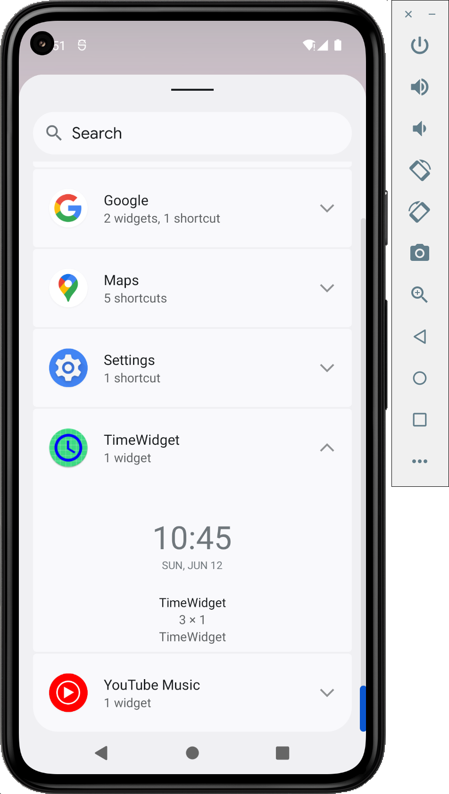
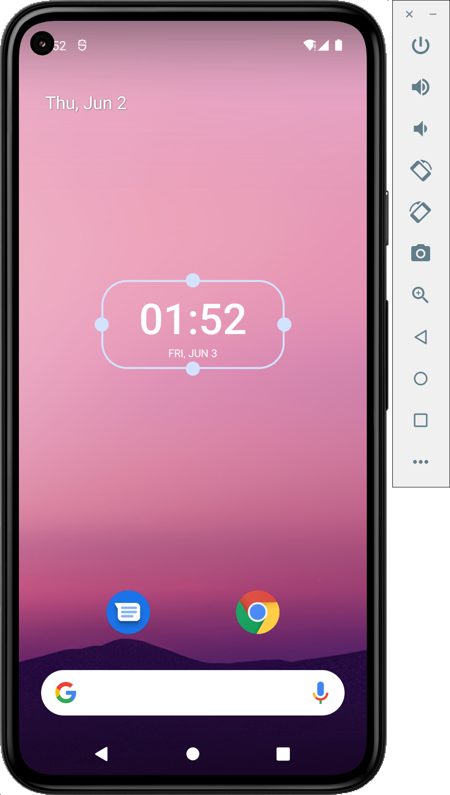

#TimeWidget App

##Description
Time Widget application provides a simple time widget that corresponds to a system time. It is 
sensitive to manual time and time zone changing.

##Technologies
* Android SDK
* Kotlin
* Compose
* Glance 
* Hilt
* Coroutine
* Flow
* Broadcast Receiver

##Images
- Preview

- Small size

- Medium size
